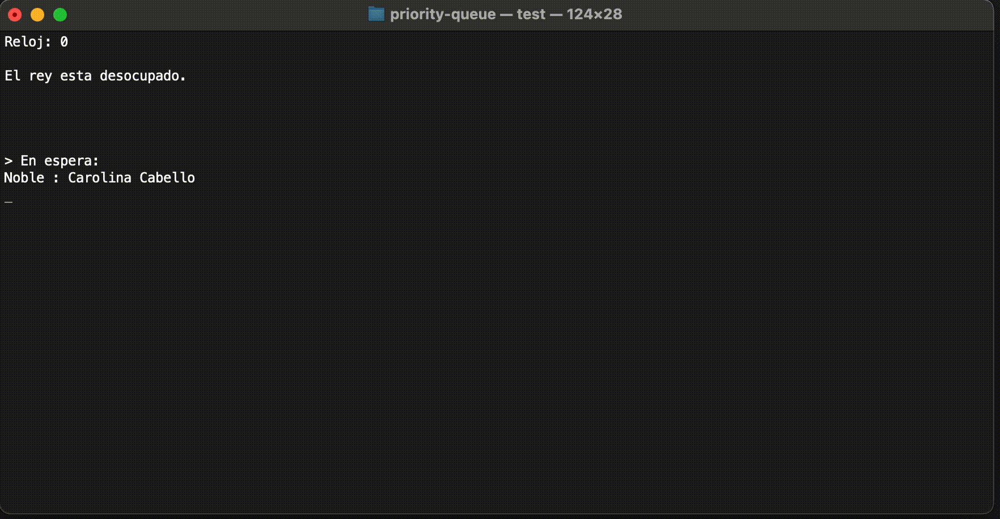
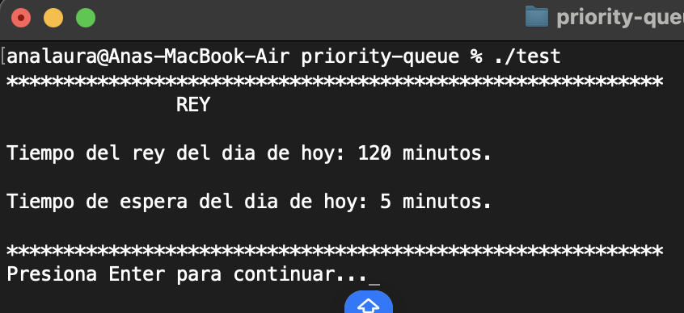

# Priority Queue in C++

This is an academic project that implements a **priority queue** using object-oriented programming in C++. It models a queue where each element has a priority, and elements are served based on their priority level rather than their order of arrival. Prioritizing Nobles over Plebeians upon insertion.


</td>

<table>
  <tr>
    <td> <h4>Start</h4>
    </td>
    <td><h4>Concluisions of the process (there are more people but I cut it off)</h4>
    </td> 
  </tr>
</table>

## Description

The system allows the user to:

- Insert elements with an associated priority
- Remove the highest priority element
- Display the current queue state
- Demonstrate how priority affects order of processing

This is particularly useful for simulating real-world systems like:

- Emergency rooms
- Operating system schedulers
- Customer service queues

## Learning Objectives

- Understand the concept of priority queues
- Apply class-based design with encapsulation
- Practice data structure manipulation in C++
- Develop menu-driven user interfaces


## Compile and run

```bash
clang++ -std=c++17 -Wall -o test main.cpp priority-queue/ColaMedieval.cpp 
./test
```

For Windows users:
You can run the executable `priority-queue.exe`

## Sample Interaction


## Author

- Ana Laura Chenoweth Galaz
- Georgina Salcido Valenzuela

## License

This project is shared for educational purposes under the MIT License.

